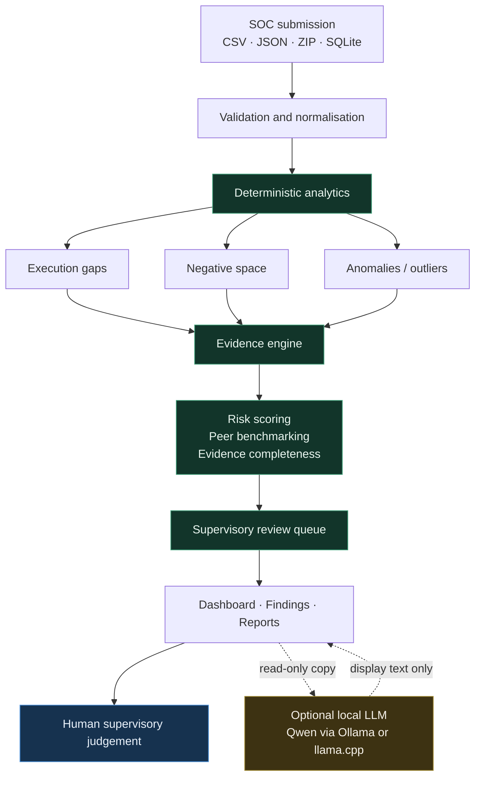

# SAT-SA — Supervisory Analytics Tool for SOC Assessment

**Smart India Hackathon 2026 · Problem statement SIH26157 · NTRO / NCIIPC**

An offline desktop application that helps a supervisory examiner assess how
well a **Critical Sector Entity (CSE)** actually ran its Security Operations
Centre — using the entity's own periodic alert and case-management submission
as the evidence.

Every finding is produced by a deterministic rule, carries the records it came
from, and traces back to the submitted rows. An optional local language model
may restate a finding in plainer words; it can never create, remove or re-rank
one.

It supports supervisory judgement. **It does not replace it.**

> **v0.9.1** · 611 tests · 112 UI smoke checks · no network connection of any
> kind, at any point.

<h3 align="center">
  <a href="https://github.com/Charan89k/Supervisory-Analytics-Tool-for-SOC-Assessment-SAT-SA-/releases/latest/download/SAT-SA-Windows.zip">
    ⬇&nbsp; Download SAT-SA for Windows
  </a>
</h3>

<p align="center">
  <a href="https://github.com/Charan89k/Supervisory-Analytics-Tool-for-SOC-Assessment-SAT-SA-/releases">
    
  </a>
  
  
</p>

<p align="center"><sub>
Extract the ZIP and run <code>SAT-SA\SAT-SA.exe</code> — no installer, no
Python, no administrator rights, ~180&nbsp;MB extracted.<br>
Keep the folder intact: this is a one-directory build and the executable does
not start without <code>_internal\</code> beside it.
</sub></p>

> **No release is published yet, so that link will 404.** The badge above
> reports the real state and corrects itself the moment one exists. Publishing
> takes one command — see [Publishing a Windows release](#publishing-a-windows-release).

---

## Contents

| | |
|---|---|
| [The problem](#the-problem) | what SIH26157 asks for |
| [What SAT-SA does](#what-sat-sa-does) | the solution, end to end |
| [What SAT-SA is not](#what-sat-sa-is-not) | scope boundaries |
| [Architecture](#architecture) | where the authority sits |
| [Capabilities in v0.9.1](#capabilities-in-v091) | what is actually implemented |
| [Installation](#installation) | source and packaged |
| [Evaluator quick start](#evaluator-quick-start) | twelve steps |
| [Detection](#detection) | the 14 rules and how they score |
| [Evidence completeness](#evidence-completeness) | what the score cannot say |
| [The AI layer](#the-ai-layer-is-optional-and-supplementary) | and its hard limits |
| [Offline operation](#offline--air-gapped-operation) | air-gapped deployment |
| [Validation](#validation) | measured, with its limits stated |
| [Limitations](#limitations) | read this one |

---

## The problem

The **National Critical Information Infrastructure Protection Centre** assesses
the cyber resilience of **Critical Sector Entities** — banks, power utilities,
telecoms, hospitals. Each runs a Security Operations Centre: analysts watching
alerts, opening cases, escalating what matters.

As part of an assessment, NCIIPC examiners read samples of those alert and case
records by hand. That manual review consistently finds things no policy
document, audit, self-assessment or KPI dashboard reveals — a CRITICAL alert
closed in three minutes, an escalation the entity's own policy required that
never happened, a telemetry source that has reported nothing for months.

The purpose is not to assess individual alerts. The records are **operational
evidence** about whether the entity has working capabilities: threat detection,
investigation, escalation, incident response, security operations, governance,
operational discipline, cyber resilience.

**Manual review works but does not scale.** An examiner can read a sample of a
few hundred records. A CSE produces hundreds of thousands, and there are many
CSEs.

---

## What SAT-SA does

It reads a periodic submission and surfaces what a policy review cannot.

**Execution gaps** — documented controls say one thing, the operational
evidence shows another:

> A CRITICAL alert was acknowledged at 02:14 and closed at 02:17 with no
> investigation ever started. Response-time metrics look excellent.

**Negative space** — evidence that *should* exist and does not:

> Only 32 of 202 HIGH/CRITICAL alerts carry an escalation record of any kind.
> Whether escalation happened cannot be determined either way.

**Anomalies** — an entity or analyst that is a statistical outlier against
comparable peers, not against the whole population.

**Peer-relative deviation** — how an entity compares with others in its own
sector, on rates normalised per 100 alerts.

Then it ranks entities by risk, prioritises what a human should read first, and
traces every finding back to the rows it came from.

```
SOC submission (CSV / JSON / ZIP / SQLite)
        │
        ▼
  Validation ─────────── structural checks; every issue reported together
        │
        ▼
  Normalisation ──────── one internal model, whatever the input format
        │
        ▼
  Deterministic analytics
        ├── Execution-gap detection      9 rules
        ├── Negative-space detection     5 rules
        └── Anomaly detection            z-scores against sector peers
        │
        ▼
  Evidence engine ────── every finding keeps the records behind it
        │
        ▼
  Risk scoring ───────── linear, hand-recomputable
  Peer benchmarking ──── within sector, per 100 alerts
  Evidence completeness  how much could be examined at all
        │
        ▼
  Supervisory review queue ── correlated into cases, every CSE represented
        │
        ▼
  Dashboard · Findings · Reports (JSON · CSV · PDF)
        │
        ▼
  [optional] Local AI explanation — on request, never automatic
        │
        ▼
  HUMAN EXAMINER ─────── forms the supervisory judgement
```

**The deterministic layer is authoritative.** Everything a supervisor acts on
comes from rules whose thresholds sit in one readable configuration file. The
AI layer only rephrases what those rules already decided.

---

## What SAT-SA is not

| It is not | |
|---|---|
| a SIEM | it does not collect or correlate logs |
| a SOC | it does not detect intrusions |
| real-time monitoring | it assesses periodic submissions, after the fact |
| continuous telemetry collection | it holds no live connection to any entity |
| a national monitoring platform | it is an examiner's desktop tool |
| autonomous response | it takes no action, ever |
| a cloud or SaaS AI service | it runs entirely offline; see [AI.md](docs/AI.md) |
| a replacement for the examiner | it prioritises and evidences; a human decides |

---

## Architecture



The dashed path is the only place the AI appears. It receives a **defensive
copy** of an already-decided finding and returns display text. It never sits
between the data and the decision.

Layers, threading and lifecycle: [ARCHITECTURE.md](docs/ARCHITECTURE.md).

---

## Capabilities in v0.9.1

| Capability | Status |
|---|---|
| Ingestion — CSV folder, JSON file, JSON folder, ZIP, SQLite | implemented |
| Structural validation, all issues reported together | implemented |
| Normalisation to one internal model across all formats | implemented |
| Multi-table joining (`build_alerts_enriched`) | implemented |
| Execution-gap detection — 9 rules | implemented |
| Negative-space detection — 5 rules | implemented |
| Anomaly detection — peer-relative z-scores | implemented |
| Peer benchmarking within sector, per 100 alerts | implemented |
| Linear risk scoring, hand-recomputable | implemented |
| Evidence generation and drill-down to submitted rows | implemented |
| Evidence completeness, reported beside the score | implemented |
| Supervisory review queue with per-CSE coverage | implemented |
| Findings explorer with filters and search | implemented |
| Dashboard — ranking, drivers, capability mapping, trends | implemented |
| Trend analysis across submission periods | implemented |
| Reporting — JSON, CSV, PDF, trend JSON, validation text | implemented |
| Multi-CSE assessment (verified at 30 entities) | implemented |
| Assessment history — immutable, timestamped | implemented |
| Detection validation against seeded ground truth | implemented |
| Fully offline operation | implemented |
| Optional local AI explanation (Ollama or llama.cpp) | implemented |
| Installation self-check | implemented |
| Windows `.exe` build | spec present; **not yet built** |

---

## Installation

Step-by-step, including AI and troubleshooting:
**[INSTALLATION.md](docs/INSTALLATION.md)**.

### From source

```bash
python -m venv venv && source venv/bin/activate    # Windows: venv\Scripts\activate
pip install -r requirements-desktop.txt

# Generate a synthetic dataset with seeded, reproducible ground truth
python data/generator/generate_dataset.py --socs 5 --alerts-per-soc 800 \
    --out data/synthetic

python desktop.py
```

`python desktop.py` **is the application.** There is no server to start and no
address to visit.

Inside it: **New Assessment** → drop or browse to `data/synthetic` → validation
runs automatically → **RUN ASSESSMENT** (~1.5 seconds) → Dashboard, Findings,
Review Queue, Benchmarking and Reports unlock.

Three dependency sets, so you install only what you need:

| File | Installs | For |
|---|---|---|
| `requirements.txt` | pandas, pyyaml, reportlab, requests | headless engine (`main.py`) — no Qt, no display |
| `requirements-desktop.txt` | the above + PySide6 | the desktop application |
| `requirements-dev.txt` | the above + pytest, pyinstaller, streamlit, plotly | tests and packaging |

Ollama, Qwen and llama.cpp are **not** Python dependencies and appear in none
of these files. The AI layer is optional and provisioned separately.

### System dependencies (Linux)

Qt needs its platform libraries, which most desktops already have. If the
window fails to open:

```bash
sudo pacman -S libxcb xcb-util-wm xcb-util-image xcb-util-keysyms \
    xcb-util-renderutil libxkbcommon-x11                        # Arch
sudo apt install libxcb-xinerama0 libxkbcommon-x11-0 libegl1    # Debian/Ubuntu
```

### Windows — download and run

**There is no downloadable Windows build yet.** The repository has tags
`v0.9.0` and `v0.9.1`, but no GitHub Release with attached files — a tag marks
source, not a distributable. To get a Windows build today you must produce one
yourself on Windows: [packaging/BUILD.md](packaging/BUILD.md).

Once a release is published, the route is:

```
GitHub  ->  Releases  ->  download SAT-SA-Windows.zip
        ->  extract, keeping the folder intact
        ->  run SAT-SA\SAT-SA.exe
```

No clone and no Python installation needed.

**Download the whole folder, never just the .exe.** This is a one-directory
PyInstaller build: `SAT-SA.exe` is 11 MB of a 179 MB application, and the rest
lives in `_internal\` beside it.

```
SAT-SA/
├── SAT-SA.exe            11 MB
├── _internal/           168 MB   Python, Qt, plugins, rule configuration
├── SAT-SA-Setup-AI.ps1   optional local AI setup
├── INSTALL.txt
└── README.txt
```

Run alone, the executable does not start — verified. With `_internal\` beside
it, `--self-check` passes.

> **Verification status.** The Windows build has been produced and exercised
> **under Wine on Linux** — a genuine `PE32+` binary whose GUI launches and
> whose self-check passes. It has **not** been run on real Windows. Defender
> and SmartScreen behaviour, code signing, the PowerShell install path, DPI
> scaling and a real end-to-end Local AI explanation are all unverified.
> Native Windows testing is required before distribution.

The build produces a **folder**, not an installer. No Python is required on the
target machine, and SAT-SA itself needs no administrator rights.

```
1. Extract the package somewhere writable — Documents\SAT-SA is a good choice.
   Program Files is not: SAT-SA does not need elevation and does not ask for it.

2. (Optional) Enable local AI — run once:
       Right-click SAT-SA-Setup-AI.ps1  →  Run with PowerShell

3. Verify the install:
       SAT-SA.exe --self-check

4. Launch:
       SAT-SA.exe
```

If PowerShell blocks the script, use a **process-scoped** bypass that expires
with the window — do not change the machine-wide policy:

```powershell
powershell -NoProfile -ExecutionPolicy Bypass -File .\SAT-SA-Setup-AI.ps1
```

The `.exe` must be built **on Windows**; PyInstaller does not cross-compile.
See [packaging/BUILD.md](packaging/BUILD.md).

### Publishing a Windows release

The download button above resolves once a release carrying
`SAT-SA-Windows.zip` exists. Nothing is committed to the repository — the
179 MB build is git-ignored, and the ZIP lives only as a release asset.

`.github/workflows/windows-release.yml` builds it **on a real Windows
runner**, which matters: development builds are cross-compiled under Wine and
cannot exercise a Windows kernel, Defender, or the PowerShell paths in the
optional AI setup. The workflow runs the test suite, builds, stages the setup
script and notes, runs `SAT-SA.exe --self-check` on the runner, checks no
model or vendor installer ended up in the package, zips the folder, and
attaches it.

Pushing a version tag is the whole process:

```bash
git tag -a v0.9.2 -m "SAT-SA v0.9.2"
git push origin v0.9.2
```

To produce a package without tagging — for a dry run — trigger **Windows
package** from the Actions tab. The ZIP is attached to that run for 30 days
as a downloadable artifact.

Note that `v0.9.0` and `v0.9.1` are already tagged, so pushing them again will
not trigger a build. Either tag a new version, or run the workflow manually
against the existing tag with *Attach to release* enabled.

### Headless pipeline

The same analytics without a GUI:

```bash
python main.py --data data/synthetic --out outputs --export-csv --export-pdf
python main.py --data data/multi-period --out outputs --trends
python main.py --data data/synthetic --out outputs --validate
```

| Flag | Effect |
|---|---|
| `--data` | input dataset directory (default `./data/synthetic`) |
| `--out` | where results are written (default `outputs`) |
| `--config` | rules file (default `config/assessment_rules.yaml`) |
| `--export-csv` | also write the flat CSV exports |
| `--export-pdf` | also write the PDF executive summary |
| `--validate` | measure detection against a labelled dataset's ground truth |
| `--trends` | assess each period separately and compare |
| `--narrate` | run the optional explanation layer |

---

## Evaluator quick start

Twelve steps. Substitute `SAT-SA.exe` for `python desktop.py` on a packaged
build.

```bash
# 1. Prepare
python -m venv venv && source venv/bin/activate
pip install -r requirements-desktop.txt

# 2. Verify the installation — no assessment run, no model loaded
python desktop.py --self-check

# 3. Start SAT-SA
python desktop.py
```

Then, inside the application:

| # | Action | What to look for |
|---|---|---|
| 4 | **New Assessment → Run Demonstration Assessment** (`Ctrl+D`) | ~4 s: 15 synthetic CSEs, 4,942 alerts; banner marks the data synthetic |
| 5 | **Dashboard** | 15 entities ranked, risk drivers, capability areas, `Evidence` column |
| 6 | **Findings** | 2,860 findings; filter by entity, severity or rule |
| 7 | Select a finding | rule id, hedged rationale, structured evidence |
| 8 | **Load source records** | the submitted rows behind that finding |
| 9 | **Review Queue** | 108 findings in 33 cases; every CSE represented |
| 10 | **Benchmarking** | 3 peer groups of 5; deviation from peer median |
| 11 | **Reports** | Executive Summary PDF, JSON, four CSVs, validation report |
| 12 | **Review Queue → Explain Top Findings** | *optional* — only with a local model installed |

To demonstrate offline operation, disconnect the network and repeat steps 4–11.
Nothing changes.

The demonstration runs the **real pipeline** — the same ingestion, validation,
normalisation, detection, evidence, scoring and reporting a real submission
takes. Nothing is staged or pre-computed. The only thing it changes is where
the dataset came from, and that data is labelled synthetic in the status bar,
on the dashboard and in the dataset name.

---

## Accepted submissions

| Format | Notes |
|---|---|
| Folder of CSV tables | the primary format |
| Folder of JSON tables | one array per table |
| Single JSON file | `{"alerts": [...], "cases": [...]}` |
| ZIP archive | inspected for unsafe paths and expansion before extraction |
| SQLite export | opened read-only |

All five resolve to the same internal model — verified by test to produce
byte-identical assessments. Nine tables are required and four optional. A
folder of period subdirectories is assessed as multiple periods for trend
analysis. See [DATA_FORMAT.md](docs/DATA_FORMAT.md).

---

## Detection

Every threshold lives in `config/assessment_rules.yaml` and is tunable without
touching code.

**Execution gaps (9)** — `MISSED_ESCALATION` · `SLOW_TRIAGE` · `FAST_CLOSURE` ·
`MISSING_EVIDENCE` · `REOPENED_CASE` · `REPETITIVE_INVESTIGATION` ·
`ANALYST_OVERLOAD` · `ACK_WITHOUT_INVESTIGATION` ·
`REPEATED_ALERT_WITHOUT_REMEDIATION`

**Negative space (5)** — `TELEMETRY_GAP` · `MISSING_ALERT_CATEGORY` ·
`LOW_ACTIVITY_OUTLIER` · `MISSING_ESCALATION_RECORDS` ·
`MISSING_INVESTIGATIONS`

Each rule with its real thresholds, guards and limitations:
[ANALYTICS.md](docs/ANALYTICS.md).

### Every finding carries three separate layers

```
evidence       raw structured facts. Never phrased as judgement.
rule_id        the deterministic rule outcome.
rationale      an INDICATOR — "may indicate", never "the analyst failed".
```

And traces the whole way down:

```
Finding → Rule → Rationale → Evidence → Source records
```

The last step re-reads the submission itself, so what an examiner verifies is
the entity's own data, not something the pipeline copied.

### Scoring is linear on purpose

```
supervisory_risk_score = Σ ( weight × (count / alerts) × 100 )
```

A supervisor can recompute any entity's score by hand. **No model sits between
the findings and the ranking.**

### The review queue covers every CSE

Findings that share an alert are correlated into one case and ranked by the sum
of their priorities. Selection is two-level: the globally highest-priority
cases, **plus each entity's own worst case**, so a few high-volume entities
cannot crowd the rest of the portfolio out of the worklist. On a 30-entity
submission, all 30 are represented. An entity with no findings is not forced
in — its absence is the correct supervisory statement about it.

---

## Evidence completeness

The risk score answers *"what problems were detected?"*. It cannot answer
*"how much of the expected assessment could be performed at all?"* — and those
two come apart badly.

Most rules read a record and ask whether it shows the right thing happened.
**A record that was never written produces no finding.** So an entity with poor
record-keeping can accumulate fewer findings — and therefore a *better* score —
than one keeping good records over identical behaviour.

SAT-SA reports, beside the risk score, how much of each submission the checks
could actually run against, and names the rules a shortfall limits:

```
Risk score              what was detected
Evidence completeness   how much could be examined at all
```

Completeness is **not** a risk score, is never folded into one, and never
changes a finding, severity, weight or rank. A low figure is a reason to ask a
question: it may equally reflect an incomplete export or a system that stores
those records elsewhere.

---

## The AI layer is optional and supplementary

```
Deterministic analytics → Finding + Evidence + Severity + Risk
                                  │  ◄── AUTHORITATIVE
                                  ▼
                        Optional local Qwen model
                                  │  ◄── SUPPLEMENTARY
                                  ▼
                        Human-readable explanation
```

The model **cannot** create a finding, remove one, change a severity, a rule
id, a score, a queue position or any evidence value, and cannot introduce a
fact the evidence does not contain. It receives a defensive copy, and the
service writes back nothing but `narration_*` fields — asserted by a test that
hands it a deliberately hostile backend.

**Explanations never run automatically.** An assessment takes seconds;
explaining findings on a CPU takes minutes and cannot change the result. The
Review Queue offers **`Explain Top Findings`** when a supervisor wants them.

Three supported configurations:

| | Runtime | Model | Use when |
|---|---|---|---|
| **A. No AI** | — | — | the default; the assessment is unaffected |
| **B. Ollama** | local service on `127.0.0.1:11434` | `qwen2.5:7b` | easiest; zero configuration |
| **C. llama.cpp** | in-process, no service, no port | local `.gguf` file | a resident daemon is not permitted |

Under **B** nothing is asked of the user: the runtime is discovered through
`PATH` and the platform's install locations, and the model list comes from the
service's own loopback API. Status is one of `AI DISABLED`, `AI NOT INSTALLED`,
`AI NOT RUNNING`, `AI MODEL MISSING`, `AI NOT CONFIGURED`,
`SAMPLE EXPLANATIONS` or `AI READY` — each naming the single action that
resolves it.

### Setting it up

SAT-SA can install the local AI for you, and never does so without being
asked. On startup it checks what is present and offers the one action that
would fix what is not — reachable at any time from **Help → Set up Local AI…**

| What it finds | What it offers |
|---|---|
| No runtime | **Install Local AI** |
| Installed, service stopped | **Start Ollama** |
| Running, model absent | **Install Qwen 2.5 3B** |
| Both present | nothing — it works |

**Continue Without AI** is always available, and choosing it changes nothing
about an assessment.

The dialog says what an action will do before it runs. Starting a stopped
service touches no network; installing the runtime or the model downloads from
the internet and says so. On Windows this delegates to the reviewed
`SAT-SA-Setup-AI.ps1` with a process-scoped execution-policy bypass — no
machine policy is changed, no firewall rule added, no remote script fetched
and run. On Linux and macOS SAT-SA prints the install command for you to run
yourself rather than piping a downloaded script into a shell.

**The Qwen model is not bundled in the executable.** It is downloaded once,
locally, into Ollama's own store. Once installed, inference is entirely local:
no assessment data reaches any external service, before or after setup.

Model choices are `qwen2.5:3b` (Fast), `qwen2.5:7b` (Balanced, default) and
`qwen2.5:14b` (Deep). 14B needs roughly 9 GB resident and is never the default.

Full detail and the safety argument: [AI.md](docs/AI.md).

---

## Offline / air-gapped operation

SAT-SA makes **no external network connection** — no licensing check, no update
check, no telemetry, no cloud AI. A grep for URLs across the product code
returns exactly one result: `http://localhost`, the optional local AI runtime.

| Component | Internet to prepare | Internet to run |
|---|---|---|
| Deterministic assessment | no | **no** |
| Python dependencies | once, to download wheels | no |
| Ollama runtime + model | once, to obtain the files | no |
| llama.cpp + `.gguf` | once, to obtain the files | no |

Nothing is downloaded automatically. `SAT-SA-Setup-AI.ps1` installs from files
placed beside it and contacts the network only if you pass `-AllowDownload`
explicitly, printing the exact URL first.

For strict air-gapped AI:

```
SAT-SA → llama.cpp (in-process) → local .gguf file
```

No service, no listening port, no separate provisioning mechanism — the model
is a data file that travels on the same media as the dataset. Procedure:
[OFFLINE_DEPLOYMENT.md](docs/OFFLINE_DEPLOYMENT.md).

---

## Validation

Detection is measured against conditions the dataset generator deliberately
injected, on the reference dataset (5 entities, 3,296 alerts):

```
ALL RULES   1,698 seeded   1,460 TP   4 FP   238 FN   99.7% precision   86.0% recall
Ranking     84 queue items, 84 correspond to a seeded condition (100.0%)
            of the top 10 by queue rank, 10 correspond to a seeded condition
Effort      84 prioritised items from 1,481 findings over 3,296 alerts —
            a supervisor reads 2.55% of the alert population to reach the queue
```

**Synthetic ground truth is not expert validation.** The generator injects the
conditions the rules look for, so agreement between them is partly circular:
these figures show the rules behave as specified, not that the specification
matches what an examiner would find. **No independent expert review has been
performed.**

Where a rule declines to fire outside its declared scope, recall is also
reported *in scope* — `ACK_WITHOUT_INVESTIGATION` reads 26.5% overall and 100%
against the conditions it can actually fire on.

Methodology and limits: [VALIDATION.md](docs/VALIDATION.md).

---

## Performance

Measured on an 8th-generation Intel Core i5 U-series laptop, 20 GB RAM, single
process. **A local benchmark on the development environment — not a capacity
guarantee.**

| Dataset | Assessment | Findings | Peak memory |
|---|---|---|---|
| 3,296 alerts / 5 entities | 1.5 s | 1,481 | — |
| 4,942 alerts / 15 entities (demonstration) | 2.9 s | 2,860 | — |
| 58,240 alerts / 30 entities | 21.0 s | 29,836 | 373 MB |

The desktop application stays responsive at that scale: page switches are
sub-100 ms with 29,836 findings loaded.

---

## Security

Submissions are treated as **untrusted input**. Implemented protections,
validated by tests:

- ZIP archives are never `extractall`-ed. Members are inspected first for
  parent-directory traversal, absolute paths, Windows drive-letter paths, UNC
  paths, control and null bytes, and symlinks or any other non-regular entry.
- Member count, per-member size, total uncompressed size and compression ratio
  are capped, and extraction is streamed so a bomb is stopped mid-write.
- Only `.csv`, `.json`, `.sqlite`, `.db` and `.sqlite3` members are extracted.
  No dataset member is ever executed.
- SQLite exports are opened **read-only** through a `file:` URI, with extension
  loading left disabled.
- The optional AI layer talks only to a loopback address.

These are implemented protections designed to reduce specific risks, not a
claim that the application is secure in an absolute sense. Threat model and
test coverage: [SECURITY.md](docs/SECURITY.md).

---

## Testing

```bash
pytest                                              # 611 tests
QT_QPA_PLATFORM=offscreen python tests/smoke_ui.py  # 112 UI checks
python desktop.py --self-check                      # installation check
```

No automated run loads a language model: `tests/conftest.py` forces
`SATSA_NARRATION_BACKEND=mock` for the whole session, and the UI smoke test
sets it before any import. What each suite defends:
[TESTING.md](docs/TESTING.md).

---

## Project structure

```
desktop.py                  THE APPLICATION — launch this
main.py                     headless pipeline (CLI)
app.py                      legacy Streamlit view — NOT the product

analytics/                  the engine; runs headless, no Qt
  ingestion/                CSV · JSON · ZIP · SQLite + safe extraction
  validator.py              structural checks
  normalizer.py             build_alerts_enriched — the shared join
  metrics/                  alert · analyst · case · escalation · telemetry
  detection/                execution_gaps.py · negative_space.py
  scoring/                  linear, hand-recomputable risk scores
  completeness.py           how much of a submission could be examined
  evidence.py               finding → the submitted rows behind it
  review_queue.py           case correlation and prioritisation
  benchmarking.py           peer comparison within a sector
  capabilities.py           findings → the eight supervisory areas
  trends.py                 comparison across submission periods
  validation.py             detection measured against ground truth
  reporting.py              JSON · CSV · PDF
  narration/                optional local model backends

application/                PySide6 desktop application
  ui.py                     MainWindow — eight pages
  session.py                lifecycle state machine
  paths.py                  bundled resources vs. writable storage
  self_check.py             --self-check
  pages/ widgets/ services/

config/assessment_rules.yaml   every threshold, weight and mapping
data/generator/                synthetic datasets with seeded ground truth
packaging/                     PyInstaller spec, AI setup script, install docs
schemas/                       assessment result schema
tests/                         611 tests + the UI smoke test
docs/                          the documents linked below
```

---

## Configuration

| What | Where |
|---|---|
| Rules, thresholds, weights, capability mapping | `config/assessment_rules.yaml` |
| Application settings | `~/.config/SAT-SA/settings.json` · Windows `%APPDATA%\SAT-SA\` |
| Assessments, from source | `assessments/<timestamp>/` — immutable |
| Assessments, packaged | `Documents\SAT-SA\assessments\` |

| Environment variable | Effect |
|---|---|
| `SATSA_NARRATION_BACKEND` | force a backend; `mock` guarantees no model loads |
| `SATSA_ASSESSMENTS_DIR` | relocate assessment history |
| `SATSA_CONFIG_DIR` | relocate the settings file |

---

## Troubleshooting

**The window does not open.** Install the Qt platform libraries listed under
Installation. Verify with
`QT_QPA_PLATFORM=offscreen python tests/smoke_ui.py` — if that passes, the
application works and the problem is the display.

**"No ground_truth.json" on `--validate`.** Only generated datasets carry
labels. A real submission cannot be validated this way, which says nothing
about whether it contains findings.

**"does not contain multiple period subdirectories" on `--trends`.** Generate
with `--periods 4`.

**AI shows NOT INSTALLED / NOT RUNNING / MODEL MISSING.** Expected without a
local runtime, and never a problem for an assessment. Each state names the one
action that resolves it; on a packaged install that is usually running
`SAT-SA-Setup-AI` once. `--self-check` reports the current state.

**Peer benchmarking says a group is too small.** Peer comparison needs at least
three entities in a sector, and the sector-relative rules need five. The
generator creates groups of at least five — regenerate with more entities,
e.g. `--socs 15`.

**Tests fail after regenerating the dataset.** Run `pytest` fresh; the fixtures
build their own assessment in a temporary directory.

---

## Limitations

- **No independent expert validation has been performed.** Every accuracy
  figure is measured against synthetic, seeded ground truth and is partly
  circular.
- **SAT-SA assesses periodic submissions, after the fact.** It is not a
  monitoring tool and has no live view of anything.
- **The human examiner remains authoritative.** Every finding is an indicator
  for review; none is a determination of fault.
- **What can be assessed depends on what was submitted.** Rules that read a
  record cannot fire when the record is absent — which is why evidence
  completeness is reported alongside the score.
- **Detection is scope-limited by design.** Fourteen rules cover the conditions
  the problem statement names; they are not an exhaustive model of SOC quality.
- **`LlamaCppBackend.explain()` has not been run against a real model.** It is
  structurally sound and configuration-tested; the generation path is unrun.
- **The Windows `.exe` has not been built.** The PyInstaller spec is present and
  a Linux build from it has been verified end to end, but PyInstaller cannot
  cross-compile.
- **The performance figures are a local benchmark**, not a production capacity
  guarantee.
- **Trends need multiple periods.** A single period reports no trend rather
  than drawing a line through one point.
- **Source drill-down runs on the UI thread** — roughly 0.2 s typically, ~1 s
  at 28,000 alerts, behind a wait cursor.
- **Live database connections and API ingestion are not implemented.**
- **`app.py` is a legacy Streamlit view** kept for development only. It is not
  the product and must not be used to evaluate SAT-SA.

---

## Demonstration flow

For a short presentation:

```
Problem  →  Dataset  →  Assessment  →  Dashboard  →  Findings  →  Evidence
         →  Review Queue  →  Report  →  [optional AI]  →  Offline
```

`Ctrl+D` runs the whole demonstration through the real pipeline in about four
seconds.

---

## Documentation

| Document | |
|---|---|
| [INSTALLATION.md](docs/INSTALLATION.md) | source, packaged, AI, self-check |
| [ARCHITECTURE.md](docs/ARCHITECTURE.md) | layers, pipeline, lifecycle, threading |
| [ANALYTICS.md](docs/ANALYTICS.md) | all 14 rules with real thresholds |
| [DATA_FORMAT.md](docs/DATA_FORMAT.md) | formats, internal model, validation |
| [AI.md](docs/AI.md) | the safety boundary and backends |
| [VALIDATION.md](docs/VALIDATION.md) | methodology and its limits |
| [SECURITY.md](docs/SECURITY.md) | untrusted-input handling |
| [OFFLINE_DEPLOYMENT.md](docs/OFFLINE_DEPLOYMENT.md) | air-gapped deployment |
| [TESTING.md](docs/TESTING.md) | how to run and what is defended |
| [packaging/BUILD.md](packaging/BUILD.md) | building the distributable |
| [CHANGELOG.md](CHANGELOG.md) | release history |
| [CONTRIBUTING.md](CONTRIBUTING.md) | development conventions |
